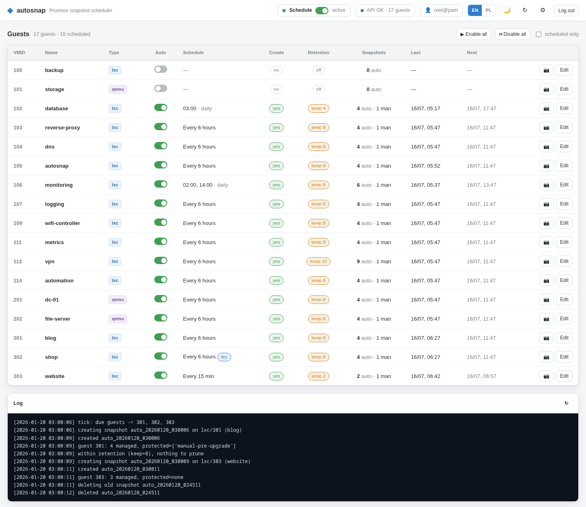
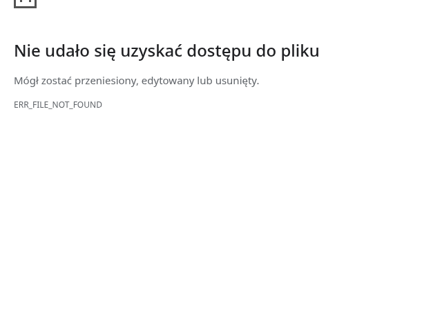

# ◆ proxmox-autosnap

**Scheduled snapshots + retention for Proxmox VE — the feature the built‑in GUI is missing.**

Proxmox has scheduled *backups* and *replication*, but no built‑in way to take
**scheduled snapshots** with **automatic retention**. `proxmox-autosnap` adds
exactly that, through a clean web UI — and does it **without modifying the
Proxmox host**, so it survives every PVE upgrade.

Everything runs inside its own unprivileged **Debian 13 LXC**. It talks to the
host only through a scoped **API token** (`VM.Snapshot` + `VM.Audit`). No patched
`pvemanagerlib.js`, no custom Perl API modules, no `apt` hooks — nothing on the
hypervisor to break when you update.



## Features

- 🗓️ **Two schedule modes** per guest: fixed **interval** (every N min/hours) or
  **calendar** (specific times of day on chosen weekdays).
- 🧹 **Retention** — keep the newest *N* automatic snapshots, prune the rest.
  Independent from creation, so you can auto‑create but delete manually.
- 🔒 **Safe by construction** — only snapshots named `auto_YYYYMMDD_HHMMSS` are
  ever pruned (double‑checked with a regex right before deletion). Manual
  snapshots (`bkp`, `pre-upgrade`, …) are physically incapable of matching.
- 🧪 **Dry‑run** per guest — log what *would* happen without touching anything.
- ⏯️ **Global pause** master switch + **bulk enable/disable all** guests.
- 👤 **Login with your Proxmox credentials** — validated live against the PVE
  ticket API, nothing stored. Change root's password in Proxmox and it just
  works here too. An **allowlist** (default `root@pam`) prevents privilege
  escalation via the tool's token.
- 🧩 **Host stays clean** — the only host‑side change is one API token + role.
  Uninstall removes them.



## Install

Run this **on your Proxmox VE host** (as root). It creates the LXC, installs the
app, and provisions the API token automatically:

```bash
bash -c "$(curl -fsSL https://raw.githubusercontent.com/Kr1sCode/proxmox-autosnap/main/install.sh)"
```

Then open `http://<container-ip>/` and log in with your Proxmox credentials
(`root@pam` by default). That's it — every guest starts **disabled**; you opt in
per guest from the UI.

**Non-interactive / automation:** set `AUTOSNAP_NONINTERACTIVE=1` to skip the
whiptail wizard and drive everything with env vars:

```bash
AUTOSNAP_NONINTERACTIVE=1 AUTOSNAP_CTID=250 AUTOSNAP_BRIDGE=vmbr1 \
AUTOSNAP_NET=10.10.10.50/24,gw=10.10.10.1 AUTOSNAP_STORE=local-zfs \
bash -c "$(curl -fsSL https://raw.githubusercontent.com/Kr1sCode/proxmox-autosnap/main/install.sh)"
```

Supported: `AUTOSNAP_CTID`, `AUTOSNAP_HOSTNAME`, `AUTOSNAP_CORES`, `AUTOSNAP_RAM`,
`AUTOSNAP_DISK`, `AUTOSNAP_STORE`, `AUTOSNAP_BRIDGE`, `AUTOSNAP_NET` (`dhcp` or
`CIDR,gw=…`).

> **HTTPS:** the app serves plain HTTP inside the container. Put it behind a
> reverse proxy (e.g. Nginx Proxy Manager) for TLS + a domain.
>
> **Exposure:** the panel only accepts users on its allowlist, but it wields a
> snapshot‑capable token. Don't expose it publicly without an extra layer
> (proxy Access List, VPN/Tailscale).

## How it works

```
┌──────────────────────── Proxmox VE host ─────────────────────────┐
│  guests (LXC / QEMU)          API token: autosnap@pve!manager     │
│        ▲                       role AutoSnap = VM.Snapshot,VM.Audit│
│        │ snapshot/delete via REST (https://<host>:8006)           │
│  ┌─────┴───────────────── LXC: autosnap ──────────────────────┐   │
│  │  web UI (Flask/gunicorn :80)   scheduler (systemd timer)   │   │
│  │  config /etc/autosnap/config.json   login → PVE ticket API │   │
│  └────────────────────────────────────────────────────────────┘   │
└───────────────────────────────────────────────────────────────────┘
```

- The **scheduler** ticks every 5 minutes, evaluates each enabled guest's
  schedule, and creates/prunes snapshots via the Proxmox REST API.
- Snapshots are ordinary PVE snapshots — they show up in the normal
  Snapshots panel and can be rolled back the usual way.

## Manage

```bash
# update the app in an existing container (config is preserved)
bash -c "$(curl -fsSL https://raw.githubusercontent.com/Kr1sCode/proxmox-autosnap/main/update.sh)" -- <CTID>

# remove everything (container + host token/role); guest snapshots are kept
bash -c "$(curl -fsSL https://raw.githubusercontent.com/Kr1sCode/proxmox-autosnap/main/uninstall.sh)" -- <CTID>
```

CLI inside the container (`/opt/autosnap/autosnap.py`):

```bash
python3 autosnap.py tick            # run all due guests (what the timer calls)
python3 autosnap.py run <vmid>      # snapshot (per config) + prune now
python3 autosnap.py snapshot <vmid> # force one snapshot now
python3 autosnap.py prune <vmid>    # prune only
```

## Configuration

`/etc/autosnap/config.json`:

```json
{
  "settings": { "pve_host": "10.0.0.1", "pve_port": 8006, "verify_tls": false, "paused": false },
  "auth": { "allowlist": ["root@pam"] },
  "guests": {
    "303": { "enabled": true, "mode": "interval", "interval_minutes": 15, "create": true, "keep": 2, "prefix": "auto", "dryrun": false },
    "102": { "enabled": true, "mode": "calendar", "times": ["03:00"], "weekdays": [], "create": true, "keep": 4, "prefix": "auto", "dryrun": false }
  }
}
```

`weekdays`: `0`=Mon … `6`=Sun; empty = every day. Times are the container's
local timezone.

## Requirements

- Proxmox VE 8 or 9
- A Debian 13 container template (the installer downloads it if missing)
- Outbound internet in the container (for `apt` + fetching the app)

## Try the UI

`docs/demo.html` is a fully self‑contained, backend‑free demo with mock data —
open it in any browser to click around the interface.

## License

MIT — see [LICENSE](LICENSE).
